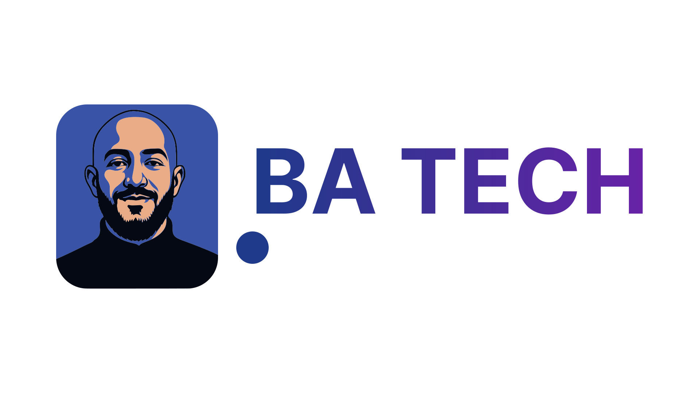

<h1 align="center">Hello There! I'm Mohanad Bahashwan 👋</h1>

### About Me

Full-Stack Developer with **3+ years of experience** building production-grade web applications —
from multi-module CRM systems to large-scale marketplace analytics and automation platforms.

Founder & Lead Developer of **[Ba-Tech](https://ba-tech.ru/)** — a web development agency that has
delivered **40+ projects for 15+ clients** across web, UI/UX, e-commerce, and mobile.

- 🏢 **Ba-Tech** — Founder & Lead Developer · [ba-tech.ru](https://ba-tech.ru/)
- 🔭 Currently building a **Wildberries seller analytics platform** at SalesBoost
- 🛠️ Full cycle: architecture → REST API → React UI → Docker → CI/CD → production
- 🤖 Browser automation expert: Puppeteer, stealth stacks, CAPTCHA solving, proxy rotation
- 🌍 Arabic (Native) · English (Professional) · Russian (Professional)
- 📍 Riyadh, Saudi Arabia — Saint Petersburg, Russia

&nbsp;

- 📫 Telegram — [t.me/Bahashwan_Mohanad](https://t.me/Bahashwan_Mohanad)
- 📧 E-mail — **Bahashwan@mail.ru**
- 💼 LinkedIn — [linkedin.com/in/mohanad-bahashwan](https://www.linkedin.com/in/mohanad-bahashwan/)
- 🌐 Agency — [ba-tech.ru](https://ba-tech.ru/)

---

### Обо мне

Fullstack-разработчик с **опытом 3+ года** — от многомодульных CRM-систем до крупных аналитических
и автоматизационных платформ для маркетплейсов.

Основатель и ведущий разработчик **[Ba-Tech](https://ba-tech.ru/)** — веб-агентства, реализовавшего
**40+ проектов для 15+ клиентов** в сфере веб-разработки, UI/UX, e-commerce и мобильных приложений.

- 🏢 **Ba-Tech** — основатель и ведущий разработчик · [ba-tech.ru](https://ba-tech.ru/)
- 🔭 Сейчас строю **аналитическую платформу для продавцов Wildberries** в SalesBoost
- 🛠️ Полный цикл: архитектура → REST API → React UI → Docker → CI/CD → production
- 🤖 Эксперт по браузерной автоматизации: Puppeteer, стелс-стек, обход CAPTCHA, ротация прокси
- 🌍 Арабский (родной) · Английский (профессиональный) · Русский (профессиональный)
- 📍 Эр-Рияд, Саудовская Аравия — Санкт-Петербург, Россия

&nbsp;

- 📫 Telegram — [t.me/Bahashwan_Mohanad](https://t.me/Bahashwan_Mohanad)
- 📧 E-mail — **Bahashwan@mail.ru**
- 💼 LinkedIn — [linkedin.com/in/mohanad-bahashwan](https://www.linkedin.com/in/mohanad-bahashwan/)
- 🌐 Агентство — [ba-tech.ru](https://ba-tech.ru/)

---

<h3 align="left">Frontend</h3>

  &nbsp;
  &nbsp;
  &nbsp;
  &nbsp;
  &nbsp;
  &nbsp;
  &nbsp;
  &nbsp;
  &nbsp;

<h3 align="left">Backend</h3>

  &nbsp;
  &nbsp;
  &nbsp;
  &nbsp;

<h3 align="left">Databases & Infrastructure</h3>

  &nbsp;
  &nbsp;
  &nbsp;
  &nbsp;
  &nbsp;

<h3 align="left">Testing & Tools</h3>

  &nbsp;
  &nbsp;
  &nbsp;
  &nbsp;
  &nbsp;
  &nbsp;
  &nbsp;

---

  
  

  

